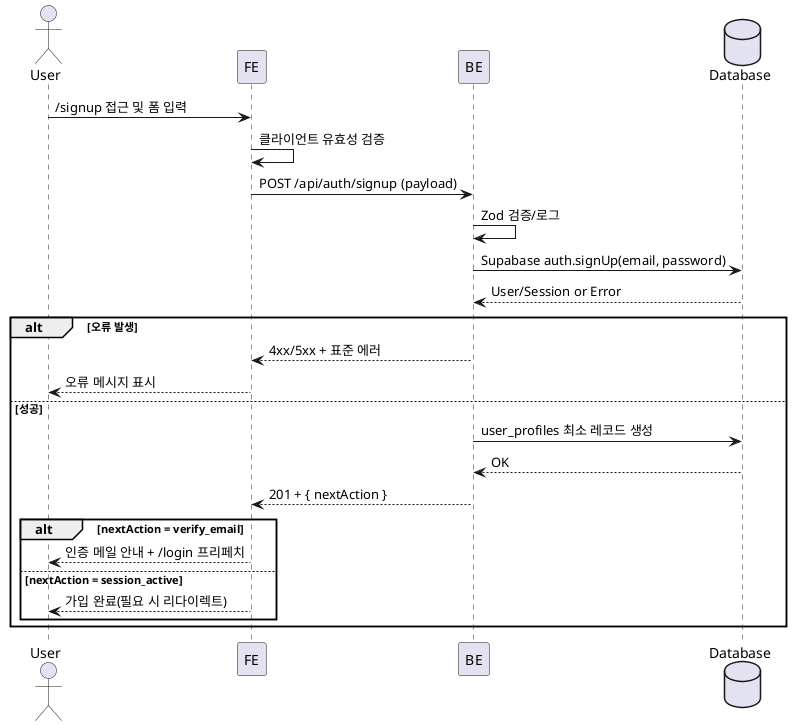

# 기능 1: 회원가입 — Use Case Spec (Option B, Hono BE 오케스트레이션)

**Primary Actor**
- 비로그인 사용자(최초 가입자)

**Precondition (사용자 관점)**
- 유효한 이메일 주소를 보유하고 있다.
- 현재 로그인되어 있지 않다.

**Trigger**
- 사용자가 `/signup` 페이지에서 폼 제출(서버로 POST `/api/auth/signup`).

**Main Scenario**
1. 사용자가 이메일/비밀번호/이름/휴대폰/역할/약관동의를 입력한다.
2. FE는 클라이언트 유효성 검사를 수행한다(형식, 필수값, 비밀번호 일치, 약관 체크).
3. FE는 Hono BE로 POST `/api/auth/signup` 요청(JSON) 전송.
4. BE는 Zod 검증, 로깅,(선택) 레이트리밋/봇 방지 후 Supabase 서버 클라이언트로 `auth.signUp` 호출.
5. BE는 응답의 사용자 ID로 `user_profiles` 최소 레코드를 생성한다.
6. BE는 결과와 다음 액션(`verify_email` 또는 `session_active`)을 반환한다.
7. FE는 성공 메시지를 표시하고 `/login`을 프리페치한다(세션 없음 시 이메일 인증 안내).

**Edge Cases**
- 비밀번호 불일치: FE에서 제출 차단 및 경고 표시.
- 이메일 중복/약한 비밀번호: BE에서 Supabase 오류 메시지 반환 → FE 노출.
- 잘못된 형식: BE Zod 오류 상세 포함 반환 → FE 필드 하이라이트.
- DB 삽입 실패: BE 500과 함께 오류 코드 반환.
- 인증 링크 만료: 로그인 화면에서 재전송 기능 제공(후속).

**Business Rules**
- 하나의 이메일로 하나의 계정만 생성 가능.
- 역할(advertiser|influencer)과 약관 동의는 가입 시 필수.
- BE에서 입력 검증(Zod)과 오류 표준화.
- 이메일 인증이 필요한 경우 세션 없이 안내 메시지 반환.
- 가입 완료 후 최소 프로필(`user_profiles`)을 즉시 생성.

