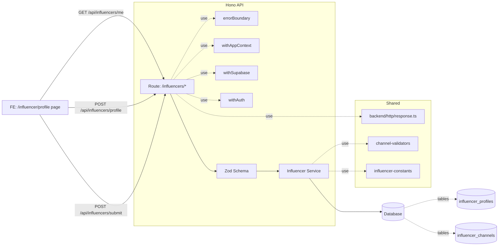

# 인플루언서 정보 등록 — 모듈화 설계 계획서 (기능 2)

## 개요
- Module: influencer-route — Path: `src/features/influencer/backend/route.ts`
  - Hono 라우트. `GET /influencers/me`, `POST /influencers/profile`(임시저장), `POST /influencers/submit`(확정). `respond()` 표준 응답 사용.
- Module: influencer-schema — Path: `src/features/influencer/backend/schema.ts`
  - Zod DTO 스키마. 프로필/채널 payload, 응답·에러 타입 정의. 날짜·URL 형식 1차 검증.
- Module: influencer-service — Path: `src/features/influencer/backend/service.ts`
  - 비즈니스 로직. 정책 검증(연령/개수/중복/패턴) → 트랜잭션으로 `influencer_profiles` upsert 및 `influencer_channels` 일괄 upsert/삭제.
- Module: influencer-error — Path: `src/features/influencer/backend/error.ts`
  - 에러 코드/타입. 가드·정책 위반·DB 오류를 코드화하여 FE에 일관 전달.
- Module: influencer-constants — Path: `src/features/influencer/constants.ts`
  - 정책 상수(최소 연령, 최대 채널 수), 허용 플랫폼 enum. 값은 `backend/config`에서 주입(하드코딩 금지).
- Module: influencer-messages — Path: `src/features/influencer/messages.ts`
  - 사용자 노출 메시지 상수(성공/가드/에러). i18n 고려해 중앙집중 관리.
- Module: influencer-routes-const — Path: `src/features/influencer/routes.ts`
  - FE/BE간 API 경로 상수화(`/api/influencers/*`). 라우팅 하드코딩 방지.
- Module: auth-middleware — Path: `src/backend/middleware/auth.ts`
  - `withAuth({ requiredRole })` 미들웨어. 토큰→유저 주입(`c.var.user`), 역할 가드.
- Module: channel-validators — Path: `src/shared/validators/channel.ts`
  - 플랫폼별 URL 정규화·검증 유틸, 중복 판단 키 생성.
- Integration: hono-app-register — Path: `src/backend/hono/app.ts`
  - `registerInfluencerRoutes(app)` 호출 추가. 기존 미들웨어 순서 유지.
- Presentation (FE) — Path: `src/app/(protected)/influencer/profile/page.tsx`
  - 화면/UI 상태/폼 관리. API 바인딩, 에러 표준화 표시, 저장/제출 분리, 중복 제출 방지.
- DB Migration — Path: `supabase/migrations/00xx_influencer_profiles_rls.sql`
  - `influencer_profiles`/`influencer_channels` RLS 정책 생성(본인만 CRUD). 누락 시 403/500 방지.

관련 컨벤션/가이드라인
- 기능 구조: `route.ts / service.ts / schema.ts / error.ts` 분리 — 예제(`src/features/example/backend/*`)와 회원가입 기능 준수.
- 표준 응답: `src/backend/http/response.ts`의 `success/failure/respond` 사용.
- 컨텍스트: `withAppContext`/`withSupabase` 사용 + 신규 `withAuth`로 유저 주입.
- 재발 방지 규칙(.ruler/AGENTS.md): 라우트 등록·DB RLS/마이그레이션 확인을 기능 활성화 전에 필수 점검.

## Diagram

## Implementation Plan

- influencer-schema (`src/features/influencer/backend/schema.ts`)
  - Types
    - ProfileUpsertRequest: `{ birthDate: string(YYYY-MM-DD), channels: ChannelInput[], idempotencyKey?: string }`
    - ChannelInput: `{ id?: string(uuid), platform: enum, name: string, url: string, _op?: 'upsert'|'delete' }`
    - SubmitRequest: `{ idempotencyKey?: string }`
    - Responses: `{ profileCompleted: boolean, channels: Array<{id, platform, name, url, verificationStatus}> }`
  - Rules
    - 날짜/URL 형식은 스키마에서 1차 검증(zod refine). 개수/중복/연령은 서비스에서 정책 검증.
    - 모든 날짜는 `YYYY-MM-DD` 고정, 서버에서 UTC로 저장.

- influencer-constants (`src/features/influencer/constants.ts`)
  - 최소연령: `INFLUENCER_MIN_AGE_YEARS`(from `backend/config`).
  - 채널 최대개수: `INFLUENCER_MAX_CHANNELS`(from `backend/config`).
  - 허용 플랫폼: DB enum과 동기화된 리스트(공유 타입 생성 시 연결).

- influencer-messages (`src/features/influencer/messages.ts`)
  - `save.success`, `submit.success`, `guard.verifiedRequired`, `error.policyAge`, `error.maxChannels`, `error.urlInvalid`, `error.duplicated` 등.

- influencer-routes-const (`src/features/influencer/routes.ts`)
  - `INFLUENCER_API_ROUTES = { me:'/api/influencers/me', save:'/api/influencers/profile', submit:'/api/influencers/submit' }`.

- channel-validators (`src/shared/validators/channel.ts`)
  - `canonicalizeUrl(url) -> string`(트레일링 슬래시/쿼리 제거, 소문자화 등)
  - `isValidPlatformUrl(platform, url) -> boolean`(플랫폼별 패턴)
  - `makeChannelDedupKey(platform, urlCanonical) -> string`

- auth-middleware (`src/backend/middleware/auth.ts`)
  - `withAuth({ requiredRole?: 'influencer'|'advertiser' })` 구현. `c.var.user={ id,email,role }` 주입. 역할 불일치시 403 조기 반환.

- influencer-service (`src/features/influencer/backend/service.ts`)
  - `getMe(supabase, userId)`
    - `influencer_profiles` + `influencer_channels` 조회. 없으면 `{ profileCompleted:false, channels:[] }` 반환.
  - `saveDraft(supabase, userId, payload)`
    - 정책 검증: 연령 계산(오늘-생년월일 ≥ MIN), 채널 수 ≤ MAX, URL 패턴/중복 제거.
    - 트랜잭션: profiles upsert(birth_date), channels upsert/삭제(op에 따라), 신규/변경은 `verification_status='pending'`.
    - 반환: 현재 채널 상태 및 `profileCompleted` 가능 여부.
  - `submitProfile(supabase, userId)`
    - `verified` 채널 존재 여부 확인 → 존재 시 profiles.`profile_completed=true` 업데이트, 미존재 시 가드 에러.
  - 표준 응답 포맷으로 반환(`success/failure`). 메시지는 `influencer-messages` 사용.

- influencer-error (`src/features/influencer/backend/error.ts`)
  - Codes
    - `UNAUTHORIZED`, `FORBIDDEN_ROLE`, `INVALID_PAYLOAD`, `POLICY_AGE_VIOLATION`, `POLICY_MAX_CHANNELS`,
      `CHANNEL_URL_INVALID`, `CHANNEL_DUPLICATED`, `DB_TX_FAILED`, `SUBMIT_VERIFIED_REQUIRED`.

- influencer-route (`src/features/influencer/backend/route.ts`)
  - 핸들러: Zod 파싱 실패→400, 역할 가드→401/403, 서비스 호출→표준 응답.
  - 라우트 등록: `registerInfluencerRoutes(app)` 내 `/influencers/*` 경로와 `/api/influencers/*` 별칭 모두 등록(404 예방).

- Integration — hono-app-register (`src/backend/hono/app.ts`)
  - `registerInfluencerRoutes(app)` 호출 추가. 기존 `errorBoundary`→`withAppContext`→`withSupabase` 흐름 유지.

- DB Migration (`supabase/migrations/00xx_influencer_profiles_rls.sql`)
  - `ALTER TABLE influencer_profiles ENABLE ROW LEVEL SECURITY;`
  - `CREATE POLICY`들: 본인(id=auth.uid())에 대해 `SELECT/INSERT/UPDATE/DELETE` 허용.
  - `influencer_channels`도 동일(조건: influencer_id=auth.uid()).
  - 정책/마이그레이션 누락 시 403/500 재현되므로, 적용 체크리스트 포함.

- Presentation (FE) (`src/app/(protected)/influencer/profile/page.tsx`)
  - 프리필: `GET /api/influencers/me`로 초기 데이터 로드.
  - 폼: 생년월일 + 채널 리스트(추가/편집/삭제). URL 즉시 검증, 중복 키 기반 경고.
  - 액션: 저장(임시)/제출(확정) 분리, 로딩 중 버튼 비활성화, 재시도 UX.
  - 에러: 표준 코드/메시지 바인딩, 토스트/필드 매핑.

- Tests — Business Logic(Unit)
  - Files: `tests/features/influencer/service.test.ts`
  - Cases
    - [ ] 정상 임시저장: upsert OK, pending 상태로 채널 반환.
    - [ ] 연령 정책 위반: `POLICY_AGE_VIOLATION` 400.
    - [ ] 채널 개수 초과: `POLICY_MAX_CHANNELS` 400.
    - [ ] URL 패턴 불일치: `CHANNEL_URL_INVALID` 400.
    - [ ] 중복 채널: `CHANNEL_DUPLICATED` 409.
    - [ ] 트랜잭션 실패: `DB_TX_FAILED` 500(원자 롤백).
    - [ ] 제출 성공: verified ≥ 1 → `profile_completed=true`.
    - [ ] 제출 가드: verified = 0 → `SUBMIT_VERIFIED_REQUIRED` 400.

- Tests — Route(Lightweight)
  - Files: `tests/features/influencer/route.test.ts`
  - Cases: 인증 없음 401, 역할 불일치 403, 파싱 오류 400, 성공 200.

### Presentation QA Sheet
- 프리필/초기화
  - [ ] 최초 접근 시 저장된 프로필/채널이 정상 로드된다.
  - [ ] 채널 추가/삭제/편집이 즉시 UI에 반영된다.
- 유효성/가드
  - [ ] 날짜 형식 오류 시 필드 에러가 표시된다.
  - [ ] 플랫폼·URL 불일치 시 저장 버튼이 비활성화되거나 서버 오류가 표시된다.
  - [ ] 채널 중복 입력 시 중복 안내가 노출된다.
  - [ ] 최소 연령 미만이면 저장/제출이 차단된다.
  - [ ] verified 채널이 없으면 제출 시 가드 메시지가 노출된다.
- 네트워크/상태
  - [ ] 저장/제출 중에는 버튼이 비활성화되고 스피너가 노출된다.
  - [ ] 서버 4xx/5xx 오류 시 표준화된 에러 메시지를 노출한다.
  - [ ] 저장 성공 시 토스트/상태가 갱신된다.

부가 고려사항
- 정책값은 `.env.local` → `src/backend/config/index.ts` → `src/features/influencer/constants.ts` 경유로 주입.
- 접근 제어: 서비스는 항상 `c.var.user.id`만 신뢰(페이로드의 사용자 식별자 무시).
- 데이터 무결성: 부분 성공 금지(트랜잭션). 실패 시 전체 롤백.
- 로깅: 실패 케이스에 에러 코드·userId 포함하여 기록.
