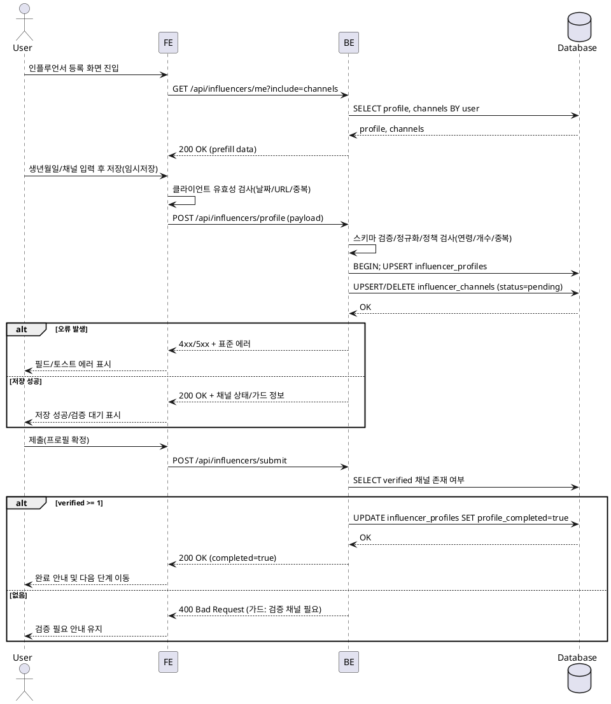

# 기능 2: 인플루언서 정보 등록 — Use Case Spec

**Primary Actor**
- 로그인 사용자(역할=인플루언서)

**Precondition (사용자 관점)**
- 이미 회원가입을 완료했다(세션 유지 중).
- 인플루언서 역할을 선택했다.
- 이메일 인증을 마쳤다(서비스 정책에 따름).

**Trigger**
- 사용자가 "인플루언서 정보 등록" 화면에서 임시저장 또는 제출 버튼을 누른다.

**Main Scenario**
1. 사용자가 생년월일을 입력하고 SNS 채널(플랫폼/채널명/URL)을 1개 이상 추가·편집·삭제한다.
2. FE는 형식 유효성(날짜·URL·중복·필수값)을 검사하고 오류가 있으면 필드 단위로 표시한다.
3. FE는 BE로 프로필+채널 변경사항을 전송한다(임시저장: POST `/api/influencers/profile`).
4. BE는 스키마 검증/정규화(날짜, 공백, URL 패턴), 정책 검증(연령, 채널 수 제한, 중복)을 수행한다.
5. BE는 트랜잭션으로 다음을 처리한다.
   - `influencer_profiles` upsert(birth_date, profile_completed=조건부 갱신)
   - `influencer_channels` 일괄 upsert/삭제, 신규·변경 채널은 `verification_status=pending`
6. BE는 저장 결과, 채널별 상태(대기/성공/실패), `profile_completed` 가능 여부를 응답한다.
7. 사용자가 "제출"을 누르면 BE는 검증된 채널(verified) 존재 여부를 확인해 `profile_completed=true`로 확정하고 성공 메시지를 반환한다(없으면 가드 메시지와 함께 미확정 유지).

**Edge Cases**
- 인증/세션 없음(401): 로그인 화면으로 유도.
- 역할 불일치(403): 접근 차단 및 역할 전환 안내.
- 연령 정책 위반(400): 생년월일 재입력 안내(최소 연령은 설정값 기반).
- URL 형식/플랫폼 불일치(400): 필드별 에러 반환 및 하이라이트.
- 채널 중복/제한 초과(409/400): 중복 제거 또는 개수 제한 알림(한도는 설정값 기반).
- DB 제약/RLS 위반(403/500): 표준화된 에러 코드와 메시지 제공, 트랜잭션 전체 롤백.
- 네트워크/중복 제출: FE에서 중복 제출 방지(disabled/로딩), BE는 멱등성 키로 안전 처리.

**Business Rules**
- `influencer_profiles.birth_date`는 필수이며 합리적인 과거 날짜여야 한다.
- 최소 연령 정책을 충족해야 한다(환경/설정값으로 관리).
- 플랫폼은 허용 enum 범위 내여야 하며 URL은 플랫폼별 패턴을 만족해야 한다.
- 동일 사용자는 동일 플랫폼·URL 조합을 중복 보유할 수 없다.
- `profile_completed=true`는 최소 1개 이상의 `verified` 채널이 있을 때만 가능하다.
- 채널 최대 개수는 설정값으로 제한한다.
- 모든 저장은 트랜잭션으로 처리하며 부분 성공을 허용하지 않는다.

