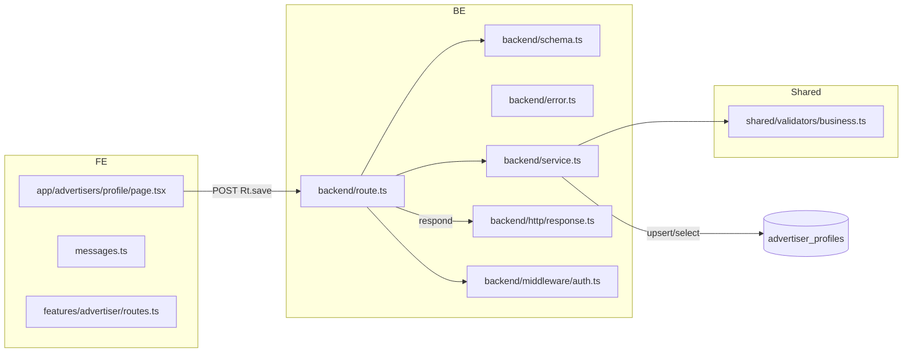

# 003. 광고주 정보 등록 — 최소 모듈화 설계 계획

- 목적: 유스케이스(ads profile 등록) 구현을 위한 BE/FE 최소 모듈 설계와 작업 위치 정의
- 범위: 입력 검증, 정규화, 중복 검사, 저장/초안, 상태 반환, FE 폼 제출/토스트 피드백

## 개요
- src/shared/validators/business.ts — 사업자등록번호 정규화/검증 유틸
- src/features/advertiser/routes.ts — FE에서 사용하는 API 경로 상수
- src/features/advertiser/messages.ts — FE 토스트/문구 상수
- src/features/advertiser/backend/schema.ts — 요청/응답 Zod 스키마 정의
- src/features/advertiser/backend/error.ts — 에러 코드 상수
- src/features/advertiser/backend/service.ts — 비즈 로직(정규화·중복검사·DB upsert·검증잡 큐잉)
- src/features/advertiser/backend/route.ts — Hono 라우트 등록(withAuth, respond 사용)
- src/backend/hono/app.ts — registerAdvertiserRoutes(app) 연결
- src/app/advertisers/profile/page.tsx — 광고주 정보 입력 페이지(폼/제출/토스트)

## Diagram


## Implementation Plan

- 공통 유틸: src/shared/validators/business.ts
  - 기능: 사업자등록번호 정규화(strip hyphens/공백, 숫자만), 형식 검증(길이/숫자), 비교 키 생성
  - 메서드
    - normalizeBusinessNumber(raw: string): string
    - isValidBusinessNumber(raw: string): boolean
    - makeBizDedupKey(raw: string): string
  - 단위 테스트(설계)
    - 하이픈/공백 제거 케이스
    - 숫자 이외 문자 포함 시 false 반환
    - 길이 외/빈값 처리

- FE 경로/문구: features/advertiser/{routes,messages}.ts
  - routes.ts: `ADVERTISER_API_ROUTES = { me: '/api/advertisers/me', save: '/api/advertisers/profile', submit: '/api/advertisers/submit' }`
  - messages.ts: 성공/오류 토스트 메시지 상수(401/403/409/422/500 대응)

- Backend 스키마: features/advertiser/backend/schema.ts
  - Request
    - ProfileUpsertRequestSchema: { companyName, location, category, businessRegistrationNumber, idempotencyKey? }
    - SubmitRequestSchema: { idempotencyKey? }
  - Response
    - ProfileResponseSchema: { profileCompleted: boolean, verificationStatus: 'pending'|'verified'|'failed' }
  - 단위 테스트(설계)
    - 유효/무효 페이로드 파싱, BRN 포맷 미스 시 400

- Backend 에러: features/advertiser/backend/error.ts
  - 에러 코드 상수
    - UNAUTHORIZED, FORBIDDEN_ROLE, INVALID_PAYLOAD
    - DUPLICATE_BUSINESS_NUMBER, DB_TX_FAILED, VALIDATION_MISMATCH

- Backend 서비스: features/advertiser/backend/service.ts
  - getMe(supabase, userId)
    - advertiser_profiles 조회 → { profileCompleted, verificationStatus } 반환
  - saveDraft(supabase, userId, req)
    - 입력 정규화: 회사명/카테고리 trim, BRN normalize
    - 형식 검증: isValidBusinessNumber
    - 중복 검사: advertiser_profiles.business_registration_number UNIQUE 위반 사전 검사
    - upsert: advertiser_profiles(id=userId, ...)
    - 검증 잡 큐잉: 외부 사업자검증 연동 전까지 placeholder insert 또는 상태=‘pending’ 유지
    - 성공 시 getMe 재조회 반환
  - submitProfile(supabase, userId)
    - 프로필 필수값 존재 여부 확인(회사명/위치/카테고리/BRN)
    - profile_completed=true 업데이트 및 스냅샷 반환
  - 상태/코드 매핑
    - 400 INVALID_PAYLOAD (Zod 실패/BRN 형식 오류)
    - 401/403 — middleware에서 처리되나 service는 순수 로직 유지
    - 409 DUPLICATE_BUSINESS_NUMBER (사전 조회 또는 upsert 에러 코드 매핑)
    - 422 VALIDATION_MISMATCH (외부 검증 불일치 시; 후속 작업)
    - 500 DB_TX_FAILED (Supabase error 메시지 포함)
  - 단위 테스트(설계)
    - normalize 후 upsert 호출 파라미터 검증(mock Supabase)
    - 중복 시 409 매핑
    - 성공 플로우에서 profile_completed false→true 전환

- Backend 라우트: features/advertiser/backend/route.ts
  - withAuth({ requiredRole: 'advertiser' }) 적용
  - parseJsonSafe + respond 패턴 재사용(인플루언서와 동일 컨벤션)
  - 라우트
    - GET /advertisers/me, /api/advertisers/me → getMe
    - POST /advertisers/profile, /api/advertisers/profile → saveDraft
    - POST /advertisers/submit, /api/advertisers/submit → submitProfile
  - Business Rules 반영
    - Authorization Bearer 필수(401 방지)
    - 신규 레코드 전송 시 id 미포함
    - 응답은 respond()의 비래핑 JSON

- Hono 앱 연결: backend/hono/app.ts
  - registerAdvertiserRoutes(app) 추가(인플루언서와 동일 위치)
  - 엔드포인트 활성화 전 점검(AGENTS.md 규칙)
    - 라우트 등록 확인
    - RLS(로컬 비활성/스테이징·운영 활성) 및 advertiser_profiles 정책 검토

- FE 페이지: app/advertisers/profile/page.tsx
  - React Hook Form + ZodResolver로 클라이언트 유효성 검사(BRN 포맷, 빈값)
  - 제출 플로우
    - apiClient.post(ADVERTISER_API_ROUTES.save)
    - 성공 토스트 + 관리 메뉴 진입 가이드
    - 409/422/429/500 등 에러 메시지 매핑 표시
  - QA 시트(핵심 시나리오)
    - 필드 미입력 → 버튼 비활성 또는 에러 하이라이트(400)
    - BRN 하이픈 포함 입력 → normalize 후 저장 성공
    - BRN 형식 오류 → 클라이언트 단계에서 차단, 서버 400 매핑 확인
    - 중복 BRN 서버 응답(409) → 중복 안내 및 기존 이동 버튼 확인
    - 비로그인/토큰 누락 → 401 리다이렉트 가드 확인
    - 광고주 외 역할 → 403 가드 확인
    - 저장 성공 시 검증대기 상태 표시, 제출 성공 시 체험단 관리 접근 가능 여부 확인

### 비고/제약
- DB 스키마: docs/database.md의 advertiser_profiles 컬럼 사용(UNIQUE: business_registration_number)
- RLS: 로컬 개발은 비활성(0004_disable_rls.sql), 스테이징/운영은 활성 및 정책 복구(AGENTS.md)
- 외부 검증: 비동기 잡은 추후 구현(placeholder 함수/테이블로 큐잉), 상태는 pending 유지
- 에러 응답: respond() 사용, FE는 비래핑 JSON 스키마로 파싱(AGENTS.md Rule)

```text
Done criteria
- 인증/권한/입력/중복/저장/상태/응답 컨벤션 충족
- FE 폼에서 409/422/500 등 에러 케이스 가시적 처리
- 라우트 등록 + Hono 핸들러 연동 완료
```

