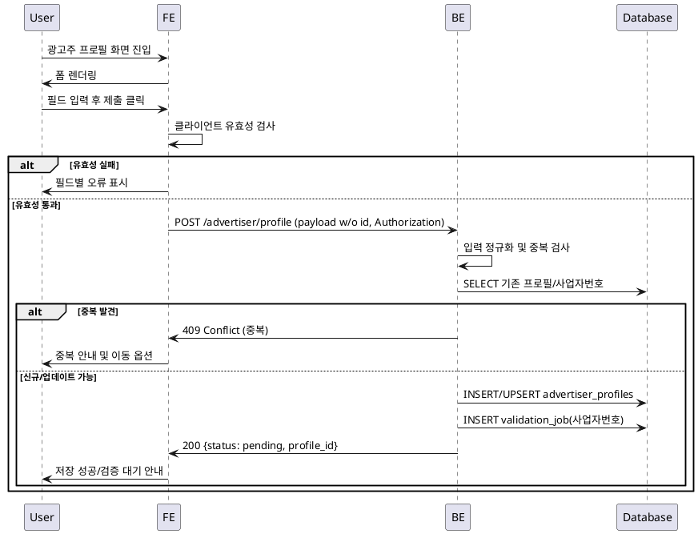

# 003. 광고주 정보 등록 — 상세 유스케이스

- Primary Actor
  - 광고주(로그인한 사용자)

- Precondition (사용자 관점)
  - 회원가입을 완료했고 역할을 광고주로 선택했다.
  - 로그인 상태에서 프로필 입력 화면에 접근했다.
  - 업체 기본정보(업체명, 위치, 카테고리, 사업자등록번호)를 보유하고 있다.
  - 초안이 있다면 이어서 편집 가능한 상태다.

- Trigger
  - 광고주 정보 입력 화면에서 제출(또는 임시저장) 버튼을 클릭한다.

- Main Scenario
  1. 사용자는 업체명, 위치, 카테고리, 사업자등록번호를 입력한다.
  2. 사용자는 제출(또는 임시저장)을 클릭한다.
  3. FE는 필수값/형식(사업자등록번호 포맷) 유효성 검사를 수행한다.
  4. FE는 유효하면 서버로 제출 요청을 전송한다.
  5. BE는 입력을 정규화(공백/하이픈 제거 등)하고 중복(기등록 프로필, 사업자번호) 여부를 확인한다.
  6. BE는 `advertiser_profiles`에 저장(생성 또는 초안 업데이트)한다.
  7. BE는 외부 사업자번호 검증을 위한 비동기 잡을 큐잉하고 상태를 검증대기로 표시한다.
  8. BE는 저장 결과와 상태(성공/검증대기/실패)를 FE에 반환한다.
  9. FE는 결과를 사용자에게 표시하고, 성공 시 체험단 관리 메뉴 진입 가이드를 노출한다.

- Edge Cases (오류 및 처리)
  - 400 잘못된 입력/누락: 필드별 오류 메시지와 포커스 이동으로 재입력 유도.
  - 401 인증 누락: 로그인 페이지로 리다이렉트 안내.
  - 403 권한 부족(광고주 아님): 역할 전환/설정 안내.
  - 409 중복(기등록 프로필 또는 사업자번호 중복): 기존 프로필 이동/연결 안내.
  - 422 사업자번호 형식 오류 또는 외부검증 불일치: 수정 요청 및 재검증 버튼 제공.
  - 429 과도한 재시도: 쿨다운 안내 후 일정 시간 경과 뒤 재시도.
  - 500/RLS 정책 오류: 잠시 후 재시도 안내, 실패 시 문의 채널 노출(내부적으로 롤백/로그).

- Business Rules
  - 유일성: 동일 사업자등록번호는 1건만 등록 가능하다.
  - 단일 프로필: 사용자당 활성 광고주 프로필은 1건만 유지한다.
  - 초안/제출: 임시저장은 가능하며, 제출 완료 시에만 체험단 관리 권한이 부여된다.
  - 정규화: 사업자등록번호는 하이픈 제거/숫자만 저장, 표시 시 포맷팅한다.
  - 보호 API: Authorization Bearer 토큰을 포함해야 한다(401 방지).
  - 신규 레코드 전송 시 `id`는 포함하지 않는다. FE는 비래핑 JSON 스키마로 파싱한다.
  - RLS: 운영 환경에서는 RLS가 활성화되며, 소유자에게만 읽기/쓰기가 허용된다.
  - 레이트 리밋/감사: 제출은 정책값 내에서 제한되며 주요 이벤트는 감사 로그에 기록한다.

