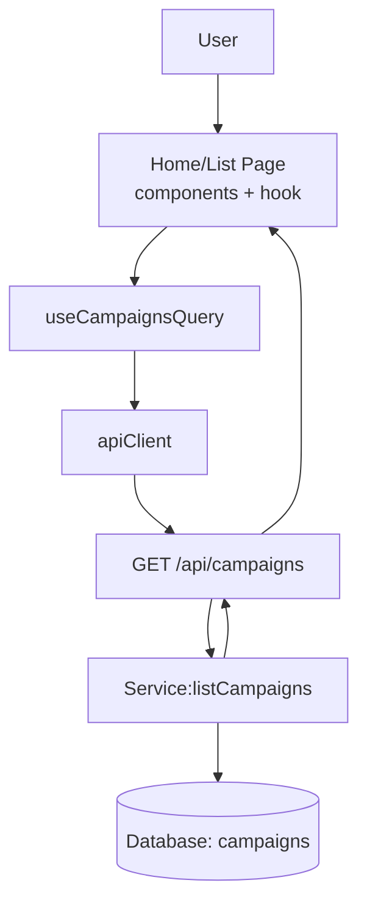

# 004. 홈 & 체험단 목록 탐색 — Module Plan

본 계획은 docs/004/spec.md 유스케이스를 기준으로 최소 단위의 모듈화를 제안합니다. 기존 코드 컨벤션(features/*, Hono 등록, respond() 비래핑 JSON, 공개 API는 토큰 불필요)을 준수합니다.

## 개요
- Module: Campaign List API
  - Path: `src/features/campaign/backend/{route.ts,service.ts,schema.ts,error.ts}`
  - Desc: 캠페인 목록 조회 REST API(GET /campaigns) — 공개 엔드포인트, 페이징/정렬/필터 검증 및 DB 조회
- Module: Campaign Routes (FE)
  - Path: `src/features/campaign/routes.ts`
  - Desc: FE에서 사용할 경로/쿼리키/상수 정의
- Module: Pagination Validator (shared)
  - Path: `src/shared/validators/pagination.ts`
  - Desc: page/pageSize/sort 정규화 및 상한선 검증(zod)
- Module: Campaign Query Hook
  - Path: `src/features/campaign/hooks/useCampaignsQuery.ts`
  - Desc: React Query로 공개 목록 API 호출, 스키마로 응답 검증
- Module: UI — CampaignCard
  - Path: `src/features/campaign/components/campaign-card.tsx`
  - Desc: 캠페인 카드 UI 컴포넌트(제목/기간/혜택/매장/배지)
- Module: UI — CampaignList
  - Path: `src/features/campaign/components/campaign-list.tsx`
  - Desc: 리스트/빈결과/에러/로딩 스테이트 포함, 카드 렌더링 및 상세 링크(`/campaigns/[id]`)
- Integration: Home Page
  - Path: `src/app/page.tsx`
  - Desc: 홈 상단 섹션 유지 + 하단에 목록 섹션 추가(필터/정렬/페이지네이션)
- Integration: Hono App Registration
  - Path: `src/backend/hono/app.ts`
  - Desc: `registerCampaignRoutes(app)` 등록(공개 API라 withAuth 미사용, withSupabase 사용)

## Diagram (mermaid)


## Implementation Plan

- Backend: schema.ts
  - Define: `CampaignListQuerySchema`(status, page, pageSize, sort, category, location, keyword, benefitType)
  - Define: `CampaignItemSchema`, `CampaignListResponseSchema`(items, meta)
  - Note: 기본값(recent, 20), 최대 페이지 크기(50), 허용된 정렬만 통과

- Backend: service.ts
  - Func: `listCampaigns(supabase, params)` → `Result<{ items, meta }, ServiceError>`
  - Logic: status='recruiting' AND public=true, 기간 내(오늘 기준) 조건 선택적 적용, LIMIT/OFFSET, total count
  - Errors: `FETCH_ERROR`, `INVALID_QUERY`
  - Unit Test: 파라미터 정규화, LIMIT/OFFSET 계산, status/정렬 가드(모크 supabase)

- Backend: error.ts
  - Codes: `INVALID_QUERY_PARAMS`, `FETCH_ERROR`
  - Map: 400/500 표준 메시지

- Backend: route.ts
  - `registerCampaignRoutes(app)`
  - GET `/campaigns`: 쿼리 파싱→스키마검증 실패 시 400, 성공 시 service 호출→respond()
  - Public: Authorization 불필요(AGENTS 규칙 준수: 보호 API 아님)

- Shared: validators/pagination.ts
  - Export: `PaginationSchema`(page>=1, pageSize<=50), `SortSchema`('recent'|'popular' 등 허용치)
  - Unit Test: 경계값/음수/초과치 정규화

- FE: routes.ts
  - Export: `CAMPAIGN_LIST_API='/api/campaigns'`, `campaignKeys.list(params)`

- FE: hooks/useCampaignsQuery.ts
  - React Query: key=campaignKeys.list(params), GET 호출, 응답 zod 파싱
  - 옵션: keepPreviousData, retry(backoff), staleTime(짧음)

- FE: components/campaign-card.tsx
  - Props: `CampaignItem` DTO
  - UI: 제목/모집기간/혜택/상태 배지, 상세 링크

- FE: components/campaign-list.tsx
  - Props: query params state, onChange
  - States: loading/success/empty/error 렌더링, 페이지네이션/필터/정렬 UI
  - QA Sheet:
    - 초기 진입: 기본 파라미터로 목록 노출(20개, 최신순)
    - 빈 결과: 안내 메시지 + 필터 초기화 노출
    - 잘못된 파라미터: 기본값으로 정규화됨을 확인
    - 네트워크 오류: 재시도/알림 토스트 확인
    - 레이트 리밋: 백오프 후 정상 로드 확인
    - 카드 클릭: `/campaigns/[id]`로 네비게이션

- Integration: src/app/page.tsx
  - 기존 안내 섹션 유지, 하단에 “모집 중 체험단” 섹션으로 CampaignList 배치
  - Prefetch: 상세 링크 프리패치 가능

- Hono App Registration: src/backend/hono/app.ts
  - `registerCampaignRoutes(app)` 호출 추가(Example/Influencer/Advertiser와 동일한 위치/순서 컨벤션)

- Non-functional
  - 응답은 비래핑 JSON(성공), 오류는 표준 에러 포맷 — respond() 준수
  - 쿼리 파라미터 화이트리스트만 허용, 하드코딩 금지(상수/스키마 사용)
  - 로컬: RLS 비활성(0004), 스테이징/프로덕션 전 정책 점검

- Test Strategy
  - Business(unit): `listCampaigns` 쿼리 빌드/정규화, pagination/sort 경계 테스트
  - Shared(unit): `PaginationSchema` 경계/정규화
  - Presentation(QA): 상기 QA Sheet 수동 시나리오 + React Testing Library 도입 검토(추후)

```note
본 계획은 현재 저장소의 컨벤션(features/* 구조, Hono 등록, shared validators, respond() 규약)과 일치합니다. 공개 API이므로 Authorization 헤더는 요구하지 않습니다.
```

