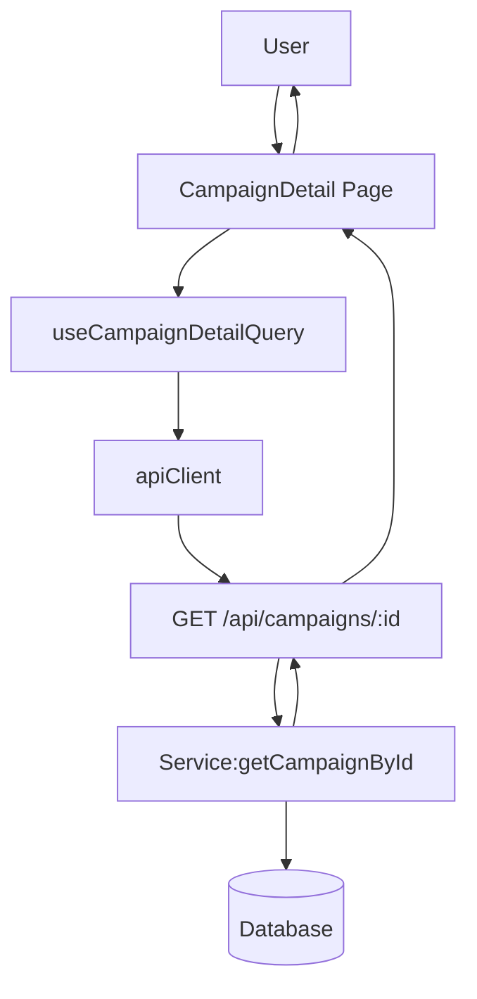

# 005. 체험단 상세 — Module Plan

docs/005/spec.md에 따른 최소 모듈 설계. 공개 API로 단건 조회 + 선택적 지원 가능 여부 계산을 제공하고, FE는 상세 페이지에서 가드를 표시합니다.

## 개요
- Module: Campaign Detail API
  - Path: `src/features/campaign/backend/{route.ts,service.ts,schema.ts,error.ts}` (기존 파일 확장)
  - Desc: GET `/campaigns/:id` 단건 조회, 토큰 있으면 applyEligibility 계산 포함
- Module: Campaign Detail Hook
  - Path: `src/features/campaign/hooks/useCampaignDetailQuery.ts`
  - Desc: React Query 훅으로 상세 조회 및 응답 스키마 검증
- Module: UI — CampaignDetail
  - Path: `src/features/campaign/components/campaign-detail.tsx`
  - Desc: 상세 정보 렌더링, 지원 버튼(활성/비활성)과 가드 메시지
- Integration: App Route
  - Path: `src/app/campaigns/[id]/page.tsx`
  - Desc: 상세 페이지 엔트리, 훅/컴포넌트 조합

## Diagram (mermaid)

## Implementation Plan

- Backend: schema.ts (확장)
  - Add: `CampaignIdParamsSchema` (id: uuid)
  - Add: `CampaignDetailSchema` = `CampaignItemSchema`
  - Add: `ApplyEligibilitySchema` { allowed: boolean, reason?: string }
  - Add: `CampaignDetailResponseSchema` { campaign: CampaignDetail, applyEligibility?: ApplyEligibility }

- Backend: service.ts (확장)
  - Func: `getCampaignById(supabase, id, userToken?)` → 단건 + 선택적 eligibility 계산
  - Eligibility: 
    - 토큰→userId→role='influencer' 확인
    - influencer_profiles.profile_completed=true
    - status='recruiting' AND 오늘이 모집기간 내
    - 미충족 사유를 reason 코드로 표준화(`UNAUTHENTICATED`|`FORBIDDEN_ROLE`|`INFLUENCER_PROFILE_INCOMPLETE`|`CAMPAIGN_NOT_RECRUITING`)
  - Errors: 400(파라미터), 404(없음), 500(DB)
  - Unit Test: 기간/상태/프로필 조건 조합, reason 계산

- Backend: route.ts (확장)
  - GET `/campaigns/:id`: params zod 검증 → service 호출 → respond()
  - 공개 API: Authorization 헤더/쿠키가 있으면 전달하여 eligibility 계산, 없으면 생략

- FE: hooks/useCampaignDetailQuery.ts
  - useQuery(key: `['/api/campaigns', id]`) → GET 요청, zod로 응답 검증
  - 토큰은 보호 API가 아니므로 필수 아님(있으면 자동 쿠키/헤더 전달 환경에서는 포함될 수 있음)

- FE: components/campaign-detail.tsx
  - Props: `campaign`, `applyEligibility`
  - UI: 제목/기간/혜택/미션/매장/모집인원/상태, 버튼 및 reason 표시
  - QA Sheet:
    - 존재하는 id: 상세 정보가 보이고 버튼 활성/비활성 상태가 일관적
    - 비로그인: 버튼 비활성 + UNAUTHENTICATED 메시지
    - 인플루언서 미완료: 비활성 + INFLUENCER_PROFILE_INCOMPLETE
    - 모집 종료: 비활성 + CAMPAIGN_NOT_RECRUITING
    - 잘못된 id: 400/404 처리 및 안내 노출

- Integration: src/app/campaigns/[id]/page.tsx
  - 로딩/에러/404/성공 분기
  - 성공 시 CampaignDetail 컴포넌트 사용

- Non-functional
  - 성공 응답 비래핑 JSON, 오류 표준 포맷 유지
  - 하드코딩 금지: reason 코드는 상수/타입으로 관리
  - 로컬 RLS 비활성 전제, 스테이징/프로덕션은 정책 점검

- Test Strategy
  - Business(unit): `getCampaignById` reason 계산 유닛 테스트(모크)
  - Presentation(QA): 위 QA Sheet 수동 확인

