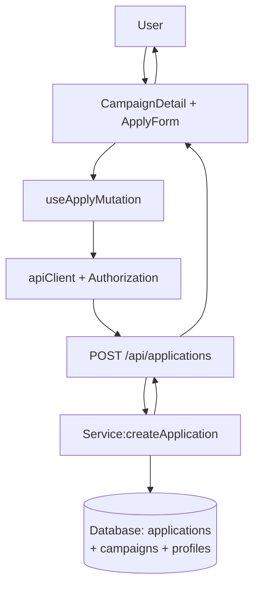

# 006. 체험단 지원 — Module Plan

본 계획은 docs/006/spec.md 유스케이스(체험단 상세에서 지원 제출)를 바탕으로 최소 모듈화 설계를 정의합니다. 저장소 컨벤션(features/*, Hono 라우팅, respond() 비래핑 JSON, 보호 API는 Authorization 필수)을 준수합니다.

## 개요
- Module: Application API (create)
  - Path: `src/features/application/backend/{route.ts,service.ts,schema.ts,error.ts}`
  - Desc: 인플루언서의 체험단 지원 생성(POST /applications). 권한·조건 검증, 중복 방지, DB 저장.
- Module: Application Routes (FE)
  - Path: `src/features/application/routes.ts`
  - Desc: FE에서 사용할 API 경로·쿼리키/뮤테이션 키 정의.
- Module: useApplyMutation
  - Path: `src/features/application/hooks/useApplyMutation.ts`
  - Desc: React Query 뮤테이션 훅. Authorization 토큰 주입, 스키마 기반 결과 파싱, 캐시 무효화.
- Module: ApplyForm (UI)
  - Path: `src/features/application/components/apply-form.tsx`
  - Desc: 각오/방문예정일 입력 폼 + 제출. 유효성·에러 표시, 성공 피드백.
- Integration: Campaign Detail Page
  - Path: `src/app/campaigns/[id]/page.tsx`
  - Desc: 상세 화면에 ApplyForm 삽입, 성공 시 상태 갱신/토스트.
- Registration: Hono App
  - Path: `src/backend/hono/app.ts`
  - Desc: `registerApplicationRoutes(app)` 호출로 백엔드 엔드포인트 활성화.

## Diagram (mermaid)


## Implementation Plan

- Backend: schema.ts
  - Request: `CreateApplicationBodySchema` { campaignId: uuid, motivation: string(최소/최대), visitDate: date(>= today) }
  - Response: `ApplicationSchema`(id, campaign_id, influencer_id, motivation, visit_date, status, created_at...), `CreateApplicationResponseSchema` { application: Application }
  - Params: 없음(POST body)

- Backend: error.ts
  - Codes: `UNAUTHORIZED`, `FORBIDDEN_ROLE`, `INVALID_BODY`, `CAMPAIGN_NOT_FOUND`, `CAMPAIGN_NOT_RECRUITING`, `PROFILE_INCOMPLETE`, `DUPLICATE_APPLICATION`, `FETCH_ERROR`, `INSERT_ERROR`
  - Map: 401/403/400/404/409/422/500

- Backend: service.ts
  - Func: `createApplication(supabase, userId, body)` → Result<{ application }, ServiceError>
  - Checks:
    - 권한: withAuth 미들웨어로 보장(requiredRole='influencer')
    - 프로필: `influencer_profiles.profile_completed=true`
    - 캠페인: 존재/상태=recruiting, 모집기간 내(today ∈ [start,end])
    - 중복: `applications`에 (campaign_id,user) 존재 여부 확인 → 있으면 409
  - Insert: `applications`(campaign_id, influencer_id=userId, motivation, visit_date, status='applied') returning *
  - Error handling: PostgREST/pg 에러코드 매핑(UNIQUE 위반 → 409)
  - Unit Tests(계획): 기간 경계/상태·중복·프로필 조합별 분기, visitDate 검증.

- Backend: route.ts
  - `registerApplicationRoutes(app)`
  - POST `/applications`: withAuth({ requiredRole: 'influencer' }) → body zod 검증 실패 시 422/400 → service 호출 → respond()
  - respond(): 성공 비래핑 JSON, 오류 표준 포맷

- FE: routes.ts
  - `APPLICATION_CREATE_API = '/api/applications'`
  - `applicationKeys = { create: () => ['/api/applications','create'] as const }`

- FE: hooks/useApplyMutation.ts
  - Supabase 세션에서 access token 획득 → Authorization Bearer 주입(AGENTS 규칙)
  - POST body: { campaignId, motivation, visitDate } (id 미포함)
  - 성공 시: 관련 쿼리 무효화(`/api/campaigns`, 상세), 토스트 메시지 리턴
  - 오류 매핑: 401/403/404/409/422/500 → 사용자 메시지

- FE: components/apply-form.tsx
  - react-hook-form + zodResolver로 클라이언트 유효성
  - Fields: motivation(textarea), visitDate(date)
  - Submit: useApplyMutation 사용, 진행 중 disabled, 성공 시 reset/피드백
  - QA Sheet:
    - 정상 제출: 성공 토스트, 버튼 재활성화, 상세/목록 갱신
    - 비로그인/토큰만료: 401 노출 후 로그인 유도
    - 권한 불일치: 403 메시지 및 프로필/역할 안내
    - 중복 지원: 409 메시지 및 내 지원 목록 안내
    - 과거 날짜/빈값: 클라 유효성 차단, 서버 422 대응 확인
    - 서버 오류: 재시도 버튼/토스트

- Integration: src/app/campaigns/[id]/page.tsx
  - 상세 아래 ApplyForm 렌더: `applyEligibility.allowed`가 false면 폼 비활성/가드 메시지 유지
  - 성공 시 페이지 내 상태 갱신(상세 쿼리 refetch)

- Non-functional
  - 하드코딩 금지: 상수/스키마 사용, 날짜 비교는 런타임 계산
  - 로컬 RLS 비활성(0004), 스테이징/프로덕션 전 RLS/정책 점검
  - 레이트 리밋은 후속 작업으로 미들웨어/헤더 기반 확장 가능

```note
보호 API는 Authorization Bearer 토큰 필수, FE는 새 레코드에 id 필드를 포함하지 않음(AGENTS.md 규칙).
```

