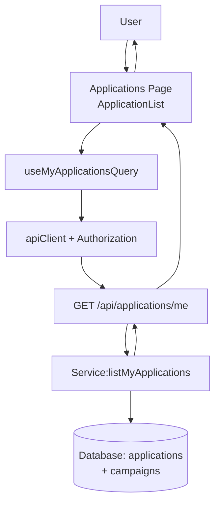

# 007. 내 지원 목록 — Module Plan

/docs/007/spec.md를 기반으로 인플루언서의 "내 지원 목록"을 구현하기 위한 최소 모듈 설계입니다. 저장소 컨벤션(features/* 구조, Hono 라우트 등록, respond() 비래핑 JSON, 보호 API는 Authorization 필수)을 준수합니다.

## 개요
- Module: My Applications API
  - Path: `src/features/application/backend/{route.ts,service.ts,schema.ts,error.ts}` (기존 파일 확장)
  - Desc: GET `/applications/me` — 현재 사용자(influencer)의 지원 목록 조회(필터/정렬/페이징, 필요 시 캠페인 요약 포함)
- Module: Application Routes (FE)
  - Path: `src/features/application/routes.ts` (확장)
  - Desc: FE 쿼리키/엔드포인트 상수 정의 (`/api/applications/me`)
- Module: useMyApplicationsQuery
  - Path: `src/features/application/hooks/useMyApplicationsQuery.ts`
  - Desc: React Query 훅. Authorization 토큰 자동 주입 환경에서 호출, 응답 zod 검증
- Module: UI — ApplicationCard
  - Path: `src/features/application/components/application-card.tsx`
  - Desc: 지원 항목 카드(상태 배지, 캠페인 제목/기간, 방문 예정일, 신청일 등)
- Module: UI — ApplicationList
  - Path: `src/features/application/components/application-list.tsx`
  - Desc: 상태 필터/페이지네이션/정렬 UI + 리스트/빈결과/에러/로딩 상태
- Integration: Protected Page
  - Path: `src/app/(protected)/applications/page.tsx`
  - Desc: 내 지원 목록 화면. 훅/컴포넌트 조합, 인증 가드(미들웨어/레이아웃에 의존)
- Registration: Hono App
  - Path: `src/backend/hono/app.ts` (확장)
  - Desc: `registerApplicationRoutes(app)`에 GET 라우트 추가됨 확인

## Diagram (mermaid)


## Implementation Plan

- Backend: schema.ts (확장)
  - Query: `MyApplicationsQuerySchema` { status: enum('all','applied','selected','rejected')=all, page>=1, pageSize<=50, sort: enum('recent')=recent }
  - DTO: `ApplicationItemSchema` (applications.*) + `CampaignSummarySchema` { id, title, recruitment_start_date, recruitment_end_date, status }
  - Response: `MyApplicationsResponseSchema` { items: Array<{ application: ApplicationItem, campaign: CampaignSummary }>, meta: { page, pageSize, total, totalPages } }

- Backend: service.ts (확장)
  - Func: `listMyApplications(supabase, userId, params)`
  - Logic:
    - `applications` where `influencer_id=userId`
    - status filter (all → 필터 없음)
    - sort by `created_at desc`
    - pagination with `count: 'exact'` and `range(from,to)`
    - campaign summary: select with foreign key join 방식(두 단계 질의 또는 두 번 조회 후 매핑)
  - Errors: `INVALID_QUERY_PARAMS`(400), `FETCH_ERROR`(500)
  - Unit Tests(계획): status 필터 매핑, offset 계산, totalPages 계산, 빈 결과 처리

- Backend: route.ts (확장)
  - GET `/applications/me`: `withAuth({ requiredRole: 'influencer' })` → 쿼리 파라미터 zod 검증 → service 호출 → respond()
  - 성공은 비래핑 JSON, 오류는 표준 에러 포맷

- FE: routes.ts (확장)
  - `applicationRoutes.me = '/api/applications/me'`
  - `applicationKeys.myList(params)`

- FE: hooks/useMyApplicationsQuery.ts
  - Query key: `applicationKeys.myList(params)`
  - axios GET 호출(Authorization은 Supabase 세션 토큰으로 Bearer 주입 또는 쿠키)
  - 응답 zod 파싱 → 반환

- FE: components/application-card.tsx
  - Props: { application, campaign }
  - UI: 캠페인 제목/모집기간, 내 지원 상태 배지/방문 예정일, 신청일
  - 액션: 상세 이동 링크(`/campaigns/{campaign.id}`)

- FE: components/application-list.tsx
  - State: status, page, pageSize, sort
  - 훅 결과에 따른 렌더: loading/empty/error/success
  - 페이지네이션, 상태 필터 셀렉트, 정렬(최신순 기본)
  - QA Sheet:
    - 로그인 사용자: 기본 파라미터로 목록 노출(최신순, 20개)
    - 상태 필터 변경: 쿼리 갱신/리스트 반영
    - 빈 결과: 안내 메시지 표시
    - 401/403: 로그인/역할 안내
    - 네트워크 오류: 재시도/토스트
    - 상세 이동: 카드 클릭 → `/campaigns/{id}`

- Integration: `src/app/(protected)/applications/page.tsx`
  - ApplicationList 컴포넌트 삽입, 보호 레이아웃에 의해 인증/리디렉션 처리

- Non-functional
  - 하드코딩 금지: 상태/정렬/페이징 상수는 스키마/상수로 관리
  - 보호 API: Authorization Bearer 필수(AGENTS 규칙), respond() 규약 준수
  - 로컬 RLS 비활성(0004). 스테이징/프로덕션 전 정책 점검

```note
FE는 조회 전용 기능으로 새 레코드 생성이 없으나, 보호 API 호출 시 Authorization 누락을 방지합니다.
```
