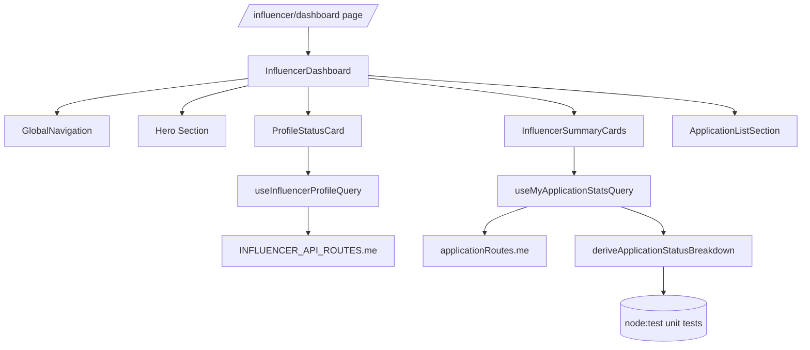

# 011. 인플루언서 대시보드 고도화 — 모듈화 설계

## 1. Use Case Insights
- 참고 문서: `docs/007/spec.md`(내 지원 목록 UC), `docs/userflow.md`(인플루언서 여정)
- 대시보드는 인플루언서가 로그인 후 자신의 지원 현황을 한눈에 보고, 필요한 경우 프로필 등록 화면으로 이동할 수 있어야 한다.
- 보호 API는 Authorization Bearer 필수이며, `status=all|applied|selected|rejected` 파라미터 화이트리스트·페이지네이션 규칙을 따라야 한다.
- 빈 결과, 인증 오류, 역할 불일치 등 예외 흐름에서 가드 메시지와 재시도/유도 액션을 노출해야 한다.

## 2. Existing Implementation Survey
- `src/app/(protected)/influencer/dashboard/page.tsx` — 단순한 헤더 + `ApplicationListSection` 렌더만 제공, 글로벌 네비게이션/프로필 CTA 부재.
- `src/features/application/components/application-list.tsx` — `useMyApplicationsQuery`를 사용해 필터 가능한 카드 그리드 구현, 상태/페이지 변경 UX를 제공.
- `src/features/application/hooks/useMyApplicationsQuery.ts` — TanStack Query 기반 보호 API fetch + zod 검증 패턴, Authorization 헤더 수동 부착.
- `src/app/(protected)/influencer/profile/page.tsx` — 프로필/채널 등록 UI, `INFLUENCER_API_ROUTES.me`/`save`/`submit` 사용 패턴 확인.
- `src/features/advertiser/dashboard/components/*` — 대시보드용 상단 가드/카드 구성을 참고할 수 있는 스타일·구조 사례.

## 3. Modular Design

### 3.1 Overview
1. **`useInfluencerProfileQuery`** — `src/features/influencer/dashboard/hooks/useInfluencerProfileQuery.ts`  
   Supabase 세션 토큰을 부착해 `/api/influencers/me` 응답을 TanStack Query로 캐싱하고, 프로필 완료 여부/채널 목록을 노출.
2. **`applicationKeys.myStats` + `useMyApplicationStatsQuery`** —  
   `src/features/application/routes.ts`, `src/features/influencer/dashboard/hooks/useMyApplicationStatsQuery.ts`  
   `status=all|selected|rejected`를 요청해 총합/선정/반려 수를 얻고, 파생 로직은 전용 라이브러리에 위임.
3. **`deriveApplicationStatusBreakdown`** — `src/features/influencer/dashboard/lib/progress.ts`  
   총합/선정/반려 카운트를 받아 대기(=applied) 수, 완료율, 배지 라벨 등을 계산하는 순수 함수. Node `node:test` 기반 단위 테스트를 추가.
4. **`GlobalNavigation`** — `src/features/influencer/dashboard/components/global-navigation.tsx`  
   홈/인플루언서 프로필/대시보드로 이동 가능한 상단 글로벌 네비게이션, 세션 사용자 이메일과 로그아웃 액션 포함.
5. **`ProfileStatusCard`** — `src/features/influencer/dashboard/components/profile-status-card.tsx`  
   프로필 완료 여부, 검증된 채널 수, CTA 버튼(`인플루언서 프로필`)을 제공하는 카드.
6. **`InfluencerSummaryCards`** — `src/features/influencer/dashboard/components/summary-cards.tsx`  
   `useMyApplicationStatsQuery`와 파생 로직을 받아 핵심 지표 카드(총 지원/선정/대기)를 렌더.
7. **`InfluencerDashboard`** — `src/features/influencer/dashboard/components/influencer-dashboard.tsx`  
   글로벌 네비게이션, 히어로 섹션, 프로필 카드, 요약 카드, `ApplicationListSection`을 조합한 컨테이너.
8. **Page wiring** — `src/app/(protected)/influencer/dashboard/page.tsx`  
   기존 단순 JSX를 대시보드 컨테이너로 교체해 설계 반영.

### 3.2 Diagram

### 3.3 Implementation Plan
- **`useInfluencerProfileQuery`**
  - Query key: `['influencer-profile','me']`.
  - Fetch `/api/influencers/me` with Authorization header, `cache: 'no-store'`.
  - Parse response schema inline (profileCompleted boolean + channels array).
  - Expose `verifiedCount` derived from channels.
- **`applicationKeys.myStats` & `useMyApplicationStatsQuery`**
  - Extend `applicationKeys` with `myStats(): [applicationRoutes.me, 'stats']`.
  - Hook issues parallel requests for statuses `all`, `selected`, `rejected` (pageSize=1) to minimize payload.
  - Reuse Authorization-building helper.
  - Pass aggregated counts to `deriveApplicationStatusBreakdown`.
- **`deriveApplicationStatusBreakdown`**
  - Inputs: `{ totalAll, totalSelected, totalRejected }`.
  - Outputs: `{ totalAll, selected, rejected, applied, completionRate }`, clamp negatives, handle division by zero.
  - Add `tests/influencer-progress.test.ts` using `node:test` + `assert` to validate normal/edge cases.
- **`GlobalNavigation`**
  - Sticky top bar with brand icon, menu(`홈`, `인플루언서 프로필`, `내 지원`), current user email chip, logout button (reuse existing `handleSignOut` pattern).
  - Responsive collapse handled with flex wrap.
  - Accessibility: `nav` landmark, `aria-label`.
- **`ProfileStatusCard`**
  - Accepts profile query result, show status pill (완료/준비중), channel count, CTA button linking to `/influencer/profile`.
  - Show skeleton while loading; error state with retry CTA (refetch).
- **`InfluencerSummaryCards`**
  - Renders three cards (총 지원, 선정됨, 대기중) using stats hook.
  - Display `completionRate` as progress bar.
  - Loading skeleton + error fallback (retry).
- **`InfluencerDashboard`**
  - Compose nav + gradient hero describing benefits + `ProfileStatusCard`, `InfluencerSummaryCards`, `ApplicationListSection`.
  - Provide limited width container (`max-w-6xl`) with background layer for sophistication.
  - Pass `refetch` callbacks down for QA.
- **Page wiring**
  - Replace inline markup with `<InfluencerDashboard />`.
  - Ensure layout retains padding/responsive behavior.

#### Presentation QA Sheet
| 구분 | 시나리오 | 기대 결과 |
| --- | --- | --- |
| 네비게이션 | 홈/프로필/내 지원 메뉴 클릭 | 각각 `/`, `/influencer/profile`, 대시보드 내 앵커로 이동, sticky nav 유지 |
| 세션 가드 | Authorization 누락 시 | 글로벌 네비 대신 ProtectedLayout 리다이렉트(기존) |
| 프로필 카드 | 프로필 미완료 사용자 | 상태 pill = "준비중", CTA 활성화 |
| 요약 카드 | 통계 fetch 실패 | 오류 메시지 + "다시 시도" 버튼 노출 |
| Application 섹션 | 상태 필터 변경 | 페이지 1로 리셋, nav/hero 그대로 |
| 반응형 | <768px | nav 메뉴 줄바꿈, 카드 1열 유지 |

#### Business Logic Tests
- 파일: `tests/influencer-progress.test.ts`
- 케이스:
  1. 정상 값(total=12, selected=3, rejected=2) → applied=7, completionRate≈0.25.
  2. selected+rejected>total → applied=0으로 클램프.
  3. total=0 → completionRate=0.
- 실행: `npx tsc tests/influencer-progress.test.ts --module CommonJS --outDir .tmp-tests && node --test .tmp-tests/tests/influencer-progress.test.js`

> 위 설계를 기준으로 단계적 구현을 진행한다.
