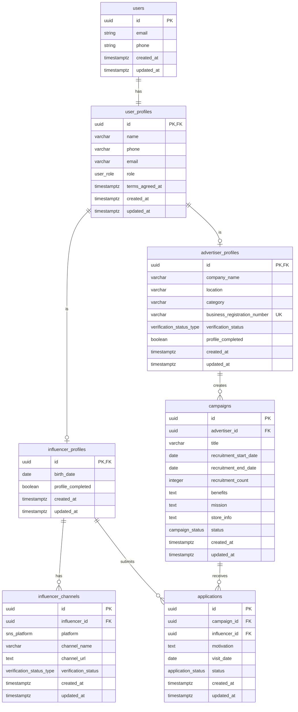

# 데이터베이스 설계: 블로그 체험단 플랫폼

## 1. 데이터 플로우 개요

### 1.1 인플루언서 데이터 플로우

```
회원가입
  ↓
users (Supabase Auth) → user_profiles (공통 정보)
  ↓
influencer_profiles (인플루언서 전용 정보)
  ↓
influencer_channels (SNS 채널 정보)
  ↓
체험단 탐색 (campaigns 조회)
  ↓
체험단 지원 → applications (지원 정보 저장)
  ↓
내 지원 목록 조회 (applications 필터링)
```

### 1.2 광고주 데이터 플로우

```
회원가입
  ↓
users (Supabase Auth) → user_profiles (공통 정보)
  ↓
advertiser_profiles (광고주 전용 정보)
  ↓
체험단 등록 → campaigns (체험단 정보 저장)
  ↓
지원자 관리 (applications 조회)
  ↓
모집 상태 전환 (campaigns 상태 업데이트)
  ↓
체험단 선정 (applications 상태 업데이트)
```

---

## 2. ERD (Entity Relationship Diagram)



---

## 3. 테이블 관계 요약

### 3.1 관계 구조

#### 사용자 인증 및 프로필
- **users (1) : (1) user_profiles**
  - 모든 사용자는 하나의 공통 프로필을 가짐
  - Cascade Delete: users 삭제 시 user_profiles도 삭제

#### 역할별 프로필 (상속 구조)
- **user_profiles (1) : (0..1) influencer_profiles**
  - role='influencer'인 경우에만 존재
  - Cascade Delete: user_profiles 삭제 시 influencer_profiles도 삭제

- **user_profiles (1) : (0..1) advertiser_profiles**
  - role='advertiser'인 경우에만 존재
  - Cascade Delete: user_profiles 삭제 시 advertiser_profiles도 삭제

#### 인플루언서 관련
- **influencer_profiles (1) : (N) influencer_channels**
  - 한 인플루언서는 여러 SNS 채널을 등록할 수 있음
  - Cascade Delete: influencer_profiles 삭제 시 모든 채널도 삭제

- **influencer_profiles (1) : (N) applications**
  - 한 인플루언서는 여러 체험단에 지원할 수 있음
  - Cascade Delete: influencer_profiles 삭제 시 모든 지원 내역도 삭제

#### 광고주 관련
- **advertiser_profiles (1) : (N) campaigns**
  - 한 광고주는 여러 체험단을 등록할 수 있음
  - Cascade Delete: advertiser_profiles 삭제 시 모든 체험단도 삭제

#### 체험단 및 지원
- **campaigns (1) : (N) applications**
  - 한 체험단은 여러 지원을 받을 수 있음
  - Cascade Delete: campaigns 삭제 시 모든 지원 내역도 삭제

- **applications: UNIQUE(campaign_id, influencer_id)**
  - 한 인플루언서는 같은 체험단에 중복 지원 불가

### 3.2 주요 제약조건

| 테이블 | 제약조건 | 설명 |
|--------|---------|------|
| `user_profiles` | FK to users | Cascade Delete |
| `influencer_profiles` | FK to users | Cascade Delete, role='influencer' 필수 |
| `advertiser_profiles` | FK to users | Cascade Delete, role='advertiser' 필수 |
| `advertiser_profiles` | UNIQUE(business_registration_number) | 사업자등록번호 중복 불가 |
| `influencer_channels` | FK to influencer_profiles | Cascade Delete |
| `campaigns` | FK to advertiser_profiles | Cascade Delete |
| `applications` | FK to campaigns, influencer_profiles | Cascade Delete |
| `applications` | UNIQUE(campaign_id, influencer_id) | 중복 지원 불가 |

### 3.3 데이터 흐름

```
사용자 생성:
users → user_profiles → (role에 따라) influencer_profiles OR advertiser_profiles

인플루언서 활동:
influencer_profiles → influencer_channels (SNS 등록)
influencer_profiles → applications → campaigns (체험단 지원)

광고주 활동:
advertiser_profiles → campaigns (체험단 등록)
campaigns ← applications (지원 접수)
```

---

## 4. 데이터베이스 스키마 (PostgreSQL)

### 4.0 ENUM 타입 정의

```sql
-- 사용자 역할
CREATE TYPE user_role AS ENUM ('advertiser', 'influencer');

-- 검증 상태
CREATE TYPE verification_status_type AS ENUM ('pending', 'verified', 'failed');

-- SNS 플랫폼
CREATE TYPE sns_platform AS ENUM ('naver', 'youtube', 'instagram', 'threads');

-- 체험단 상태
CREATE TYPE campaign_status AS ENUM ('recruiting', 'closed', 'selection_complete');

-- 지원 상태
CREATE TYPE application_status AS ENUM ('applied', 'selected', 'rejected');
```

---

### 4.1 사용자 인증 및 공통 프로필

#### `users` (Supabase Auth 기본 테이블)
- Supabase Auth가 자동 관리
- `id` (UUID, PK)
- `email`
- `phone`
- `created_at`
- `updated_at`

#### `user_profiles` (공통 사용자 프로필)
```sql
CREATE TABLE user_profiles (
  id UUID PRIMARY KEY REFERENCES auth.users(id) ON DELETE CASCADE,
  name VARCHAR(100) NOT NULL,
  phone VARCHAR(20) NOT NULL,
  email VARCHAR(255) NOT NULL,
  role user_role NOT NULL,
  terms_agreed_at TIMESTAMPTZ NOT NULL,
  created_at TIMESTAMPTZ NOT NULL DEFAULT NOW(),
  updated_at TIMESTAMPTZ NOT NULL DEFAULT NOW()
);

CREATE INDEX idx_user_profiles_role ON user_profiles(role);
CREATE INDEX idx_user_profiles_email ON user_profiles(email);
```

---

### 4.2 인플루언서 관련 테이블

#### `influencer_profiles` (인플루언서 전용 정보)
```sql
CREATE TABLE influencer_profiles (
  id UUID PRIMARY KEY REFERENCES auth.users(id) ON DELETE CASCADE,
  birth_date DATE NOT NULL,
  profile_completed BOOLEAN NOT NULL DEFAULT FALSE,
  created_at TIMESTAMPTZ NOT NULL DEFAULT NOW(),
  updated_at TIMESTAMPTZ NOT NULL DEFAULT NOW()
);

CREATE INDEX idx_influencer_profiles_completed ON influencer_profiles(profile_completed);
```

#### `influencer_channels` (SNS 채널 정보)
```sql
CREATE TABLE influencer_channels (
  id UUID PRIMARY KEY DEFAULT gen_random_uuid(),
  influencer_id UUID NOT NULL REFERENCES influencer_profiles(id) ON DELETE CASCADE,
  platform sns_platform NOT NULL,
  channel_name VARCHAR(255) NOT NULL,
  channel_url TEXT NOT NULL,
  verification_status verification_status_type NOT NULL DEFAULT 'pending',
  created_at TIMESTAMPTZ NOT NULL DEFAULT NOW(),
  updated_at TIMESTAMPTZ NOT NULL DEFAULT NOW()
);

CREATE INDEX idx_influencer_channels_influencer ON influencer_channels(influencer_id);
CREATE INDEX idx_influencer_channels_status ON influencer_channels(verification_status);
```

---

### 4.3 광고주 관련 테이블

#### `advertiser_profiles` (광고주 전용 정보)
```sql
CREATE TABLE advertiser_profiles (
  id UUID PRIMARY KEY REFERENCES auth.users(id) ON DELETE CASCADE,
  company_name VARCHAR(255) NOT NULL,
  location VARCHAR(255) NOT NULL,
  category VARCHAR(100) NOT NULL,
  business_registration_number VARCHAR(20) NOT NULL UNIQUE,
  verification_status verification_status_type NOT NULL DEFAULT 'pending',
  profile_completed BOOLEAN NOT NULL DEFAULT FALSE,
  created_at TIMESTAMPTZ NOT NULL DEFAULT NOW(),
  updated_at TIMESTAMPTZ NOT NULL DEFAULT NOW()
);

CREATE INDEX idx_advertiser_profiles_completed ON advertiser_profiles(profile_completed);
CREATE INDEX idx_advertiser_profiles_business_reg ON advertiser_profiles(business_registration_number);
```

---

### 4.4 체험단 관련 테이블

#### `campaigns` (체험단 정보)
```sql
CREATE TABLE campaigns (
  id UUID PRIMARY KEY DEFAULT gen_random_uuid(),
  advertiser_id UUID NOT NULL REFERENCES advertiser_profiles(id) ON DELETE CASCADE,
  title VARCHAR(255) NOT NULL,
  recruitment_start_date DATE NOT NULL,
  recruitment_end_date DATE NOT NULL,
  recruitment_count INTEGER NOT NULL CHECK (recruitment_count > 0),
  benefits TEXT NOT NULL,
  mission TEXT NOT NULL,
  store_info TEXT NOT NULL,
  status campaign_status NOT NULL DEFAULT 'recruiting',
  created_at TIMESTAMPTZ NOT NULL DEFAULT NOW(),
  updated_at TIMESTAMPTZ NOT NULL DEFAULT NOW()
);

CREATE INDEX idx_campaigns_advertiser ON campaigns(advertiser_id);
CREATE INDEX idx_campaigns_status ON campaigns(status);
CREATE INDEX idx_campaigns_dates ON campaigns(recruitment_start_date, recruitment_end_date);
```

---

### 4.5 지원 관련 테이블

#### `applications` (체험단 지원 정보)
```sql
CREATE TABLE applications (
  id UUID PRIMARY KEY DEFAULT gen_random_uuid(),
  campaign_id UUID NOT NULL REFERENCES campaigns(id) ON DELETE CASCADE,
  influencer_id UUID NOT NULL REFERENCES influencer_profiles(id) ON DELETE CASCADE,
  motivation TEXT NOT NULL,
  visit_date DATE NOT NULL,
  status application_status NOT NULL DEFAULT 'applied',
  created_at TIMESTAMPTZ NOT NULL DEFAULT NOW(),
  updated_at TIMESTAMPTZ NOT NULL DEFAULT NOW(),

  UNIQUE(campaign_id, influencer_id)
);

CREATE INDEX idx_applications_campaign ON applications(campaign_id);
CREATE INDEX idx_applications_influencer ON applications(influencer_id);
CREATE INDEX idx_applications_status ON applications(status);
CREATE INDEX idx_applications_influencer_status ON applications(influencer_id, status);
```

---

## 5. 주요 데이터 플로우 시나리오

### 5.1 인플루언서 회원가입 및 정보 등록

1. **회원가입**
   - `auth.users` 레코드 생성 (Supabase Auth)
   - `user_profiles` 레코드 생성 (이름, 전화번호, 이메일, 역할, 약관동의시각)

2. **인플루언서 정보 등록**
   - `influencer_profiles` 레코드 생성 (생년월일, profile_completed=true)
   - `influencer_channels` 레코드 생성 (SNS 채널 정보, 검증 상태)

### 5.2 광고주 회원가입 및 정보 등록

1. **회원가입**
   - `auth.users` 레코드 생성 (Supabase Auth)
   - `user_profiles` 레코드 생성 (이름, 전화번호, 이메일, 역할, 약관동의시각)

2. **광고주 정보 등록**
   - `advertiser_profiles` 레코드 생성 (업체명, 위치, 카테고리, 사업자등록번호, profile_completed=true)

### 5.3 체험단 등록 및 관리 (광고주)

1. **체험단 등록**
   - `campaigns` 레코드 생성
   - 초기 상태: `status='recruiting'`

2. **모집 종료**
   - `campaigns.status` 업데이트: `'recruiting'` → `'closed'`

3. **체험단 선정**
   - 선정된 지원자의 `applications.status` 업데이트: `'applied'` → `'selected'`
   - 탈락한 지원자의 `applications.status` 업데이트: `'applied'` → `'rejected'`
   - `campaigns.status` 업데이트: `'closed'` → `'selection_complete'`

### 5.4 체험단 지원 및 조회 (인플루언서)

1. **체험단 탐색**
   - `campaigns` 조회 (status='recruiting', 모집기간 내)

2. **체험단 지원**
   - `applications` 레코드 생성
   - 초기 상태: `status='applied'`
   - 중복 지원 방지: UNIQUE(campaign_id, influencer_id)

3. **내 지원 목록 조회**
   - `applications` 조회 (influencer_id 필터)
   - 상태별 필터링 (applied/selected/rejected)

---

## 6. 주요 제약사항 및 규칙

### 6.1 데이터 무결성
- 모든 외래 키는 CASCADE DELETE 적용
- 체험단 중복 지원 방지: `applications(campaign_id, influencer_id)` UNIQUE 제약
- 사업자등록번호 중복 방지: `advertiser_profiles.business_registration_number` UNIQUE 제약

### 6.2 상태 전환 규칙

**Campaign 상태:**
- `recruiting` → `closed` → `selection_complete`

**Application 상태:**
- `applied` → `selected` (선정)
- `applied` → `rejected` (탈락)

### 6.3 접근 제어
- 인플루언서: `profile_completed=true`일 때만 체험단 지원 가능
- 광고주: `profile_completed=true`일 때만 체험단 등록 가능

---

## 7. 인덱스 전략

### 7.1 조회 성능 최적화
- 역할별 사용자 조회: `user_profiles(role)`
- 모집 중인 체험단 조회: `campaigns(status, recruitment_start_date, recruitment_end_date)`
- 인플루언서의 지원 목록 조회: `applications(influencer_id, status)`
- 광고주의 체험단 지원자 조회: `applications(campaign_id)`

### 7.2 복합 인덱스
- 인플루언서의 상태별 지원 목록: `applications(influencer_id, status)`

---

## 8. 확장 가능성

현재 최소 스펙에는 포함되지 않았지만, 향후 추가 가능한 테이블:

- `terms_agreements`: 약관 동의 이력 상세 관리
- `banners`: 홈 페이지 배너 관리
- `audit_logs`: 감사 로그
- `notifications`: 알림 관리
- `reviews`: 체험단 후기 관리

---

## 9. 데이터베이스 설정

### 9.1 PostgreSQL 확장
```sql
-- UUID 생성을 위한 확장
CREATE EXTENSION IF NOT EXISTS "pgcrypto";
```

### 9.2 타임스탬프 자동 업데이트 트리거
```sql
-- updated_at 자동 업데이트 함수
CREATE OR REPLACE FUNCTION update_updated_at_column()
RETURNS TRIGGER AS $$
BEGIN
  NEW.updated_at = NOW();
  RETURN NEW;
END;
$$ LANGUAGE plpgsql;

-- 각 테이블에 트리거 적용
CREATE TRIGGER update_user_profiles_updated_at BEFORE UPDATE ON user_profiles FOR EACH ROW EXECUTE FUNCTION update_updated_at_column();
CREATE TRIGGER update_influencer_profiles_updated_at BEFORE UPDATE ON influencer_profiles FOR EACH ROW EXECUTE FUNCTION update_updated_at_column();
CREATE TRIGGER update_influencer_channels_updated_at BEFORE UPDATE ON influencer_channels FOR EACH ROW EXECUTE FUNCTION update_updated_at_column();
CREATE TRIGGER update_advertiser_profiles_updated_at BEFORE UPDATE ON advertiser_profiles FOR EACH ROW EXECUTE FUNCTION update_updated_at_column();
CREATE TRIGGER update_campaigns_updated_at BEFORE UPDATE ON campaigns FOR EACH ROW EXECUTE FUNCTION update_updated_at_column();
CREATE TRIGGER update_applications_updated_at BEFORE UPDATE ON applications FOR EACH ROW EXECUTE FUNCTION update_updated_at_column();
```
